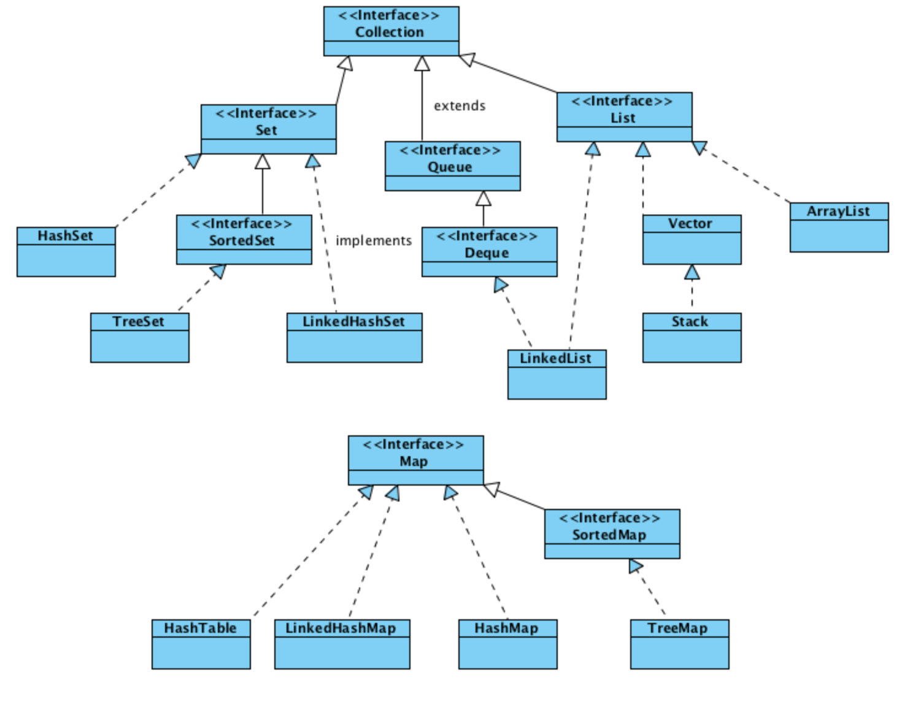

> Collections 디렉토리에 포함된 모든 문서는 "[이것이 자바다](http://bit.ly/2ie3BIb) (신용권 著)" 를 참고하였습니다.

### Collection Framework 의 계층 구조

> 출처 : [ordinarygeek.me](http://ordinarygeek.me/2009/12/02/an-overview-and-comparison-of-java-util-collections/)

### Collection Framework의 전반적인 특징

* List
    * 순서를 유지하면서 저장한다.
    * 값을 중복하여 저장할 수 있다.
* Set
    * 순서룰 유지하지 않으면서 저장한다.
    * 중복된 값을 저장할 수 없다.
* Map
    * 키와 값을 쌍으로 하여 저장한다.
    * 키를 중복하여 저장할 수 없다.
