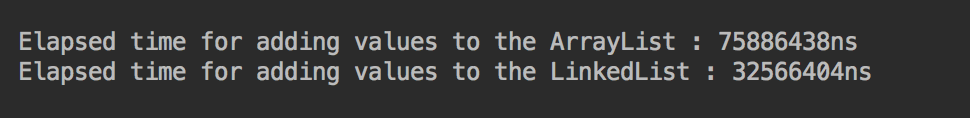
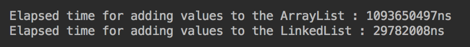

> Collections 디렉토리에 포함된 모든 문서는 "[이것이 자바다](http://bit.ly/2ie3BIb) (신용권 著)" 를 참고하였습니다.

### List Collection 의 특징

* List Collection 은 객체를 일렬로 늘어놓은 구조를 가지고 있다. 
* 객체를 List 에 저장하면 자동으로 인덱스가 붙게된다. 
* List 는 저장하는 객체의 '위치'를 참조한다. 또한 동일한 **객체를 중복 저장할 수 있다**는 특징이 있다.
* 객체를 참조하지 않을 경우 null 을 저장하는 것도 가능하다.

### ArrayList

* ArrayList 는 List 인터페이스의 구현 클래스이다.
* 일반적인 배열과 ArrayList 와의 가장 큰 차이점은, 배열은 생성할 때 크기가 정해지고 그 크기를 사용 중에 변경할 수 없는 반면, ArrayList 는 용량(capacity)이 초과하면 자동으로 크기를 늘린다는 점이다.
* 기본 생성자로 ArrayList 인스턴스를 생성하면 초기 용량이 10으로 결정되며, 생성자 매개변수에 초기 용량을 명시해줄 수도 있다.

```
List<String> list1 = new ArrayList<>();      // capacity : 10
List<String> list2 = new ArrayList<>(30);    // capacity : 30
```

* ArrayList 에 객체를 추가하면 index = 0 부터 차례대로 저장한다. 
* 특정 위치의 객체를 삭제하면, 바로 뒤의 인덱스부터 마지막에 저장된 인덱스까지 1씩 앞으로 당긴다. 마찬가지고 특정 위치에 객체를 추가하면 바로 뒤의 인덱스부터 마지막에 저장된 인덱스까지 1씩 뒤로 밀려난다.
* 따라서 데이터의 삽입과 삭제가 빈번하게 일어나는 곳에서는 ArrayList 를 사용하는것이 바람직하지 않다. (이러한 경우 LinkedList 를 사용하는 것이 좋다.)
* ArrayList 는 index 검색이나 맨 마지막에 데이터를 추가하는 경우에 좋은 성능을 발휘한다.

```
// 일반 배열을 List 로 변경하는 것도 가능하다.
String[] strArray = {"abc", "def", "ghi"};

// [일반 배열을 List 로 변경하는 방법 1]
List<String> list1 = Arrays.asList(strArray);

// [일반 배열을 List 로 변경하는 방법 2]
List<String> list2 = Arrays.asList("abc", "def", "ghi");
```

### Vector

* Vector 는 ArrayList 와 동일한 내부 구조를 가지고 있다.
* Vector 는 ArrayList 와는 달리 동기화된(synchronized) 메소드로 구성이 되어 있어서, 멀티 스레드가 동시에 Vector 의 메소드를 실행할 수 없다. 하나의 스레드가 메소드의 실행을 완료해야만 다른 스레드가 메소드를 실행할 수 있다. 이러한 특징으로 인해 Vector 는 멀티 스레드 환경에서 안전하게 객체를 추가, 삭제할 수 있다. (Thread Safe)

### LinkedList

* ArrayList 는 내부 배열에 저장된 객체를 index 로 관리를 하지만, LinkedList 는 저장된 객체를 연결하여 체인(chain)처럼 관리한다.
* LinkedList 는 중간에 데이터가 삽입되거나 삭제되어도 링크만 관리해주면 되기 때문에 ArrayList 보다 삽입/삭제 작업에서 더 좋은 성능을 발휘한다.


> 데이터를 순차적으로 삽입할 때 ArrayList 와 LinkedList 의 성능 비교


> 데이터를 중간에 삽입할 때 ArrayList 와 LinkedList 의 성능 비교

### ArrayList 와 LinkedList 비교

| 구분        | 순차적으로 추가/삭제 | 중간에 추가/삭제 | 검색  |
| ---------- | --------------- | ------------ | ---- |
| ArrayList  | 빠르다            | 느리다        | 빠르다 |
| LinkedList | 느리다            | 빠르다        | 느리다 | 

* 순차적으로 데이터를 제거할 때는 ArrayList 가 더 빠르다는 결과를 보였는데, 순차적으로 데이터를 추가할 때는 LinkedList 가 더 빠르다는 결과를 보였다.
* 전반적으로 **데이터의 추가/삭제** 작업이 많은 환경에서는 **LinkedList** 가 유리하고, **데이터의 검색**이 주 용도로 쓰이는 환경에서는 **ArrayList** 가 유리한 것으로 보인다.
